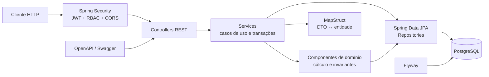
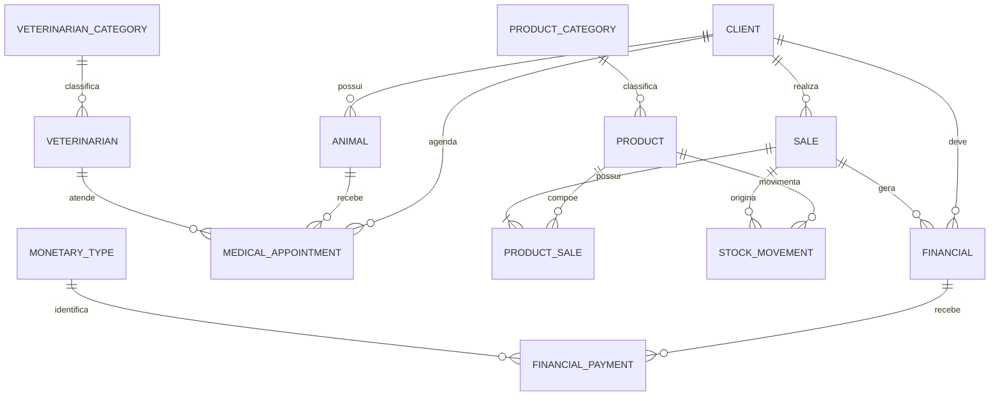
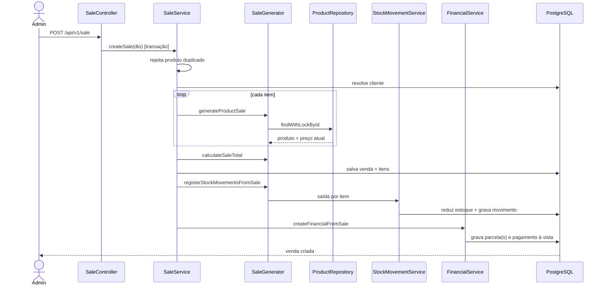
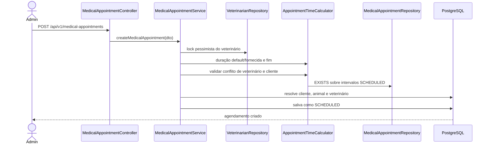

# PetShop API — documentação técnica, funcional e base de testes

## 1. Objetivo e limites desta documentação

Este documento transforma o código atual em uma referência utilizável para:

- treinamento de pessoas desenvolvedoras, QA, suporte e operação;
- entendimento da arquitetura e das responsabilidades de cada módulo;
- especificação de comportamento para testes automatizados;
- validação das regras de negócio efetivamente implementadas;
- identificação de divergências entre intenção, código, banco de dados e testes;
- planejamento de correções e evolução sem depender de conhecimento informal.

### 1.1 O que significa “regra validada” neste documento

1. regras declaradas no `README.md`;
2. código de controllers, serviços, componentes de domínio, entidades e repositórios;
3. restrições dos DTOs e do banco de dados;
4. testes existentes e resultados de execução;
5. comportamento que pode ser deduzido de forma determinística do código.

---

## 2. Resumo executivo

### 2.1 O que o sistema faz

O projeto é uma API REST monolítica para operação de um pet shop. Ela administra:

- contas de acesso e autenticação JWT;
- clientes e endereços;
- animais vinculados aos clientes;
- veterinários e suas categorias;
- agendamentos veterinários;
- produtos e categorias;
- entradas e saídas de estoque;
- vendas;
- parcelas financeiras e pagamentos;
- tipos monetários usados em pagamentos.

O desenho geral é consistente com uma aplicação Spring Boot em camadas.
- Controllers expõem HTTP.
- Services orquestram casos de uso.
- Componentes de domínio concentram cálculos.
- Repositories persistem entidades JPA.
- Mappers MapStruct fazem a conversão de DTOs.
- Flyway define o esquema.

### 2.2 Pontos do sistema

- A criação de venda, baixa de estoque e geração financeira ocorre dentro da mesma transação.
- O preço unitário da venda é lido do produto persistido, não aceito do cliente HTTP.
- Produto duplicado na mesma venda é rejeitado no serviço e também pelo banco.
- Estoque insuficiente interrompe a venda e provoca rollback da transação.
- Há bloqueio pessimista de produto em movimentos manuais e na montagem da venda.
- Há versão otimista em produto, venda, financeiro e agendamento.
- Parcelamento distribui centavos residuais na última parcela.
- Pagamento acima do saldo é rejeitado pelo serviço.
- Conflitos de agenda usam a regra correta de sobreposição de intervalos.
- Agendamentos cancelados e concluídos deixam de bloquear o horário, pois apenas `Agendados` entra na consulta de conflito.
- Senhas são persistidas com BCrypt.
- Perfis `USER` e `ADMIN` têm separação global entre leitura e escrita.
- O esquema usa Flyway e o Hibernate está configurado com `ddl-auto: validate`.
- Serviços e componentes de domínio possuem boa cobertura unitária.

---

## 3. Visão do produto e glossário

### 3.1 Glossário

| Termo | Significado no sistema |
|---|---|
| Cliente | Tutor/comprador cadastrado por CPF. |
| Animal | Pet pertencente a um cliente. |
| Categoria veterinária | Classificação/especialidade associada ao veterinário. |
| Agendamento | Consulta veterinária com início, fim calculado, duração e status. |
| Produto | Item vendável, com preço atual, categoria e saldo de estoque. |
| Movimento de estoque | Registro imutável de entrada ou saída associado a um produto e, opcionalmente, a uma venda. |
| Venda | Pedido concluído no ato da criação, com itens, total, cliente e forma `CASH` ou `INSTALLMENTS`. |
| Financeiro | Parcela/conta a receber ligada a um cliente e opcionalmente a uma venda. |
| Pagamento financeiro | Evento que reduz o saldo de um financeiro. |
| Tipo monetário | Meio usado em um pagamento, por exemplo cartão ou transferência. |
| Saldo (`balance`) | Valor ainda devido dentro de um financeiro. |
| Parcela paga (`isPaid`) | Verdadeiro somente quando o saldo chega a zero. Pagamento parcial mantém o valor falso. |

---

## 4. Arquitetura e tecnologias

### 4.1 Arquitetura lógica


---

O sistema é um **monólito modular em camadas**. Não há mensageria, cache distribuído ou chamadas a APIs externas.

### 5. Stack

| Área | Tecnologia/configuração |
|---|---|
| Linguagem | Java 21 |
| Framework | Spring Boot 3.5.6 |
| Build | Gradle Wrapper 8.14.3 |
| Web | Spring MVC / REST |
| Persistência | Spring Data JPA / Hibernate |
| Banco de produção | PostgreSQL 15 no Compose |
| Banco de teste | H2 em modo de compatibilidade PostgreSQL |
| Migração | Flyway |
| Segurança | Spring Security, JWT JJWT 0.11.5, BCrypt |
| Validação | Jakarta Bean Validation / Hibernate Validator |
| Mapeamento | MapStruct 1.6.0 e Lombok |
| Documentação de API | springdoc OpenAPI 2.8.5 / Swagger UI |
| Testes | JUnit 5, Mockito, AssertJ, Spring Test |
| Cobertura | JaCoCo |
| Containers | Docker e Docker Compose |

### 5.1 Padrões utilizados

- **DTO por operação:** create, update e response separados.
- **Service Layer:** cada agregado funcional possui um service.
- **Repository:** abstração Spring Data sobre JPA.
- **Mapper:** MapStruct reduz conversões manuais.
- **Domain Component:** regras mais complexas de venda, financeiro e agenda ficam fora do service.
- **Transaction Script:** os fluxos de venda e pagamento são orquestrados dentro de métodos `@Transactional`.
- **Optimistic/Pessimistic Locking:** versão JPA e consultas com `PESSIMISTIC_WRITE` nos pontos mais concorrentes.
- **Global Exception Handler:** erros convertidos para `StandardError`.

---

## 6. Organização do código

### 6.1 Estrutura de pacotes

```text
com.petshop.api
├── config                 configuração, segurança, OpenAPI e admin inicial
├── controller             12 controllers e 67 endpoints
├── domain
│   ├── financial          geração de parcelas e aplicação/estorno de pagamentos
│   ├── medicalAppointment cálculo e atualização de agenda
│   ├── sale               geração e cancelamento de venda
│   └── validator          resolução genérica de entidade por UUID
├── dto
│   ├── request            contratos de criação/comando
│   ├── update             contratos de PATCH
│   └── response           contratos de saída
├── exception              exceções de negócio e handler global
├── model
│   ├── entities           entidades JPA
│   ├── enums              estados e tipos fechados
│   └── mapper             interfaces MapStruct
├── repository             interfaces Spring Data
├── security               filtro e serviço JWT
└── service                casos de uso
```

### 6.2 Responsabilidade das camadas

| Camada | Responsabilidade correta |
|---|---|---|
| Controller | HTTP, status, parâmetros, validação e delegação. |
| Service | Orquestrar caso de uso, transação e dependências. |
| Domain | Cálculos e regras reutilizáveis. |
| Repository | Consulta e persistência. |
| Entity | Estado persistido e defaults básicos. |
| Mapper | Converter representação. |
| DTO | Delimitar contrato público. |
| Exception | Padronizar falhas. |

---

## 7. Modelo de dados

### 7.1 Visão de relacionamentos



### 7.2 Catálogo das tabelas

#### `product_categories`

| Coluna | Tipo/regra |
|---|---|
| `id` | UUID, PK |
| `name` | obrigatório; não é único |
| `description` | opcional |

Relacionamento: uma categoria possui vários produtos. A aplicação impede exclusão quando há produto associado.

#### `veterinarian_categories`

| Coluna | Tipo/regra |
|---|---|
| `id` | UUID, PK |
| `name` | obrigatório; não é único |
| `description` | opcional |

Relacionamento: uma categoria possui vários veterinários. A aplicação impede exclusão quando está em uso.

#### `clients`

| Coluna | Tipo/regra |
|---|---|
| `id` | UUID, PK |
| `name` | obrigatório |
| `phone` | opcional |
| `cpf` | obrigatório e único |
| `street`, `city`, `state`, `zip_code`, `complement` | endereço embutido; `street`, `city`, `state` e `zip_code` obrigatórios na criação. |

Relacionamentos: animais, vendas, financeiros e agendamentos. O endereço não é tabela separada.

#### `tb_users`

| Coluna | Tipo/regra |
|---|---|
| `id` | UUID, PK |
| `name` | obrigatório |
| `email` | obrigatório e único |
| `password` | obrigatório, hash BCrypt |
| `role` | obrigatório; enum `USER` ou `ADMIN` |

#### `veterinarian`

| Coluna | Tipo/regra |
|---|---|
| `id` | UUID, PK |
| `name` | obrigatório |
| `crmv` | obrigatório, mas não único |
| `phone` | obrigatório no banco |
| `email` | obrigatório e único |
| `category_id` | FK obrigatória para categoria veterinária |

#### `animals`

| Coluna | Tipo/regra |
|---|---|
| `id` | UUID, PK |
| `name` | obrigatório |
| `species` | obrigatório |
| `breed` | opcional |
| `birth_date` | opcional |
| `client_id` | FK para cliente; DTO de criação exige cliente |

#### `products`

| Coluna | Tipo/regra |
|---|---|
| `id` | UUID, PK |
| `version` | versão otimista |
| `name` | obrigatório |
| `description` | opcional |
| `price` | decimal obrigatório e maior que zero |
| `quantity_in_stock` | inteiro obrigatório, default zero, não negativo |
| `category_id` | FK obrigatória |


#### `sales`

| Coluna | Tipo/regra |
|---|---|
| `id` | UUID, PK |
| `version` | versão otimista |
| `sale_date` | data/hora obrigatória, default de aplicação `now` |
| `payment_type` | `CASH` ou `INSTALLMENTS`; |
| `total_value` | decimal; banco aceita nulo |
| `status` | obrigatório; `COMPLETED` ou `CANCELED` |
| `notes` | opcional |
| `client_id` | FK obrigatória |

#### `product_sales`

| Coluna | Tipo/regra |
|---|---|
| `id` | UUID, PK |
| `quantity` | obrigatório e maior que zero |
| `unit_price` | obrigatório; captura o preço histórico da venda |
| `product_id` | FK obrigatória |
| `sale_id` | FK obrigatória |
| restrição | par `(sale_id, product_id)` único |

#### `monetary_types`

| Coluna | Tipo/regra |
|---|---|
| `id` | UUID, PK |
| `name` | obrigatório e único |
| `description` | opcional |

#### `financial`

| Coluna | Tipo/regra |
|---|---|
| `id` | UUID, PK |
| `version` | versão otimista |
| `description` | obrigatório |
| `amount` | valor original, obrigatório; |
| `balance` | saldo atual, obrigatório;  |
| `date_created` | obrigatório; preenchido em `@PrePersist` |
| `due_date` | vencimento opcional no banco |
| `payment_date` | data de quitação opcional |
| `is_paid` | obrigatório |
| `installment` | número da parcela, obrigatório |
| `notes` | opcional |
| `client_id` | FK obrigatória |
| `sale_id` | FK opcional; nulo para lançamento manual |

#### `financial_payments`

| Coluna | Tipo/regra |
|---|---|
| `id` | UUID, PK |
| `paid_amount` | obrigatório; |
| `payment_date` | obrigatório |
| `notes` | opcional |
| `monetary_type` | FK opcional para tipo monetário |
| `financial_id` | FK obrigatória |


#### `stock_movements`

| Coluna | Tipo/regra |
|---|---|
| `id` | UUID, PK |
| `product_id` | FK obrigatória |
| `type` | `INPUT` ou `OUTPUT`, obrigatório |
| `quantity` | obrigatório e maior que zero |
| `date_movement` | obrigatório; default de aplicação `now` |
| `description` | opcional no banco |
| `price` | obrigatório;  |
| `sale_id` | FK opcional |
| `invoice` | opcional |

#### `medical_appointment`

| Coluna | Tipo/regra |
|---|---|
| `id` | UUID, PK |
| `version` | versão otimista |
| `notes` | opcional |
| `diagnosis` | até 500 no SQL |
| `treatment` | até 700 no SQL |
| `client_id` | FK obrigatória |
| `animal_id` | FK obrigatória |
| `veterinarian_id` | FK obrigatória |
| `appointment_start_time` | obrigatório |
| `appointment_end_time` | obrigatório |
| `duration_minutes` | obrigatório e maior que zero |
| `appointment_status` | `SCHEDULED`, `COMPLETED` ou `CANCELED` |


## 8. Segurança, autenticação e autorização

### 8.1 Fluxo de autenticação

1. `POST /api/v1/auth/register` cria um usuário com role default `USER`.
2. A senha é codificada com `BCryptPasswordEncoder`.
3. A API gera um JWT HS256 cujo `subject` é o e-mail.
4. `POST /api/v1/auth/login` autentica e devolve novo JWT.
5. Requisições autenticadas enviam `Authorization: Bearer <token>`.
6. O filtro extrai o e-mail, recarrega o usuário do banco e monta as authorities atuais.


### 8.2 Matriz global de autorização

| Requisição | Acesso |
|---|---|
| `/api/v1/auth/**` | Público |
| Swagger e OpenAPI | Público |
| `GET /api/v1/**` | `USER` ou `ADMIN` |
| Qualquer método não-GET em `/api/v1/**` | Somente `ADMIN` |
| Demais rotas | Usuário autenticado |


### 8.3 Admin inicial

`AdminUserInitializer` roda na inicialização. Se `ADMIN_EMAIL` e `ADMIN_PASSWORD` estiverem preenchidos e o e-mail ainda não existir, cria uma conta `ADMIN` com senha BCrypt. Se qualquer campo estiver vazio ou o e-mail existir, não faz nada.


## 9. Especificação técnica e prática por módulo

### 9.1 Autenticação e usuários

**Objetivo:** criar contas de consulta, autenticar e emitir JWT.

| Componente | Papel |
|---|---|
| `AuthController` | Expõe registro e login. |
| `AuthService` | Cria usuário, codifica senha, autentica e emite token. |
| `User` | Entidade e implementação de `UserDetails`. |
| `UserRepository` | Busca por e-mail. |
| `JwtService` | Geração, parsing, subject e expiração. |
| `JwtAuthenticationFilter` | Autenticação Bearer por requisição. |
| `ApplicationConfig` | UserDetailsService, provider, manager e BCrypt. |
| `SecurityConfig` | RBAC, sessão stateless e CORS. |
| `AdminUserInitializer` | Provisionamento opcional do primeiro admin. |


### 9.2 Clientes e endereço

**Objetivo:** manter o tutor/comprador e seus dados cadastrais.

| Componente | Papel |
|---|---|
| `ClientController` | CRUD e busca por nome. |
| `ClientService` | Valida CPF duplicado, atualiza e decide exclusão. |
| `Client`, `Address` | Cliente persistido e endereço embutido. |
| `ClientRepository` | Paginação, busca por nome e existência por CPF. |
| `ClientMapper`, `AddressMapper` | Mapeamento e PATCH com campos nulos ignorados. |

Regras efetivas:

- CPF é obrigatório, válido segundo validador brasileiro e único na criação;
- CPF não pode ser alterado pelo PATCH;
- endereço é obrigatório na criação;
- cliente devolve seus animais no response;
- exclusão é bloqueada se existir qualquer agendamento;
- animais são excluídos em cascata quando o cliente é excluído;
- vendas e financeiros também referenciam cliente.


### 9.3 Animais

**Objetivo:** cadastrar pets vinculados a um tutor.

| Componente | Papel |
|---|---|
| `AnimalController` | CRUD, filtro por nome e espécie. |
| `AnimalService` | Resolve cliente, persiste e bloqueia exclusão em uso. |
| `Animal` | Nome, espécie, raça, nascimento e cliente. |
| `AnimalRepository` | Paginação e buscas textuais. |
| `AnimalMapper` | Conversão e PATCH. |

Regras efetivas:

- nome, espécie e cliente são obrigatórios na criação;
- raça e nascimento são opcionais;
- tutor não pode ser alterado pelo PATCH;
- data de nascimento futura não é permitida;
- exclusão é bloqueada por qualquer agendamento.

### 9.4 Categorias de veterinário

**Objetivo:** classificar veterinários por especialidade ou função.
|---|---|
| `VeterinarianCategoryController` | CRUD, filtro por nome e espécie. |
| `VeterinarianCategoryService` | Resolve categoria, persiste e protege exclusão. |
| `VeterinarianCategory` | Dados da categoria. |
| `VeterinarianCategoryRepository` | Busca e verificação de uso. |
| `VeterinarianCategoryMapper` | DTOs e atualização parcial. |

Regras:

- nome obrigatório na criação;
- categoria não pode ser excluída se algum veterinário a usa;

### 9.5 Veterinários

**Objetivo:** manter profissionais responsáveis pelos agendamentos.

| Componente | Papel |
|---|---|
| `VeterinarianController` | CRUD e busca por nome. |
| `VeterinarianService` | Resolve categoria, persiste e protege exclusão. |
| `Veterinarian` | Dados profissionais e categoria. |
| `VeterinarianRepository` | Busca, lock pessimista e uso de categoria. |
| `VeterinarianMapper` | DTOs e atualização parcial. |

Regras efetivas:

- nome, CRMV, categoria e e-mail são obrigatórios na API;
- e-mail é único;
- CRMV não é único;
- exclusão é bloqueada se existir qualquer agendamento;

### 9.6 Agendamentos veterinários

**Objetivo:** reservar um intervalo para veterinário, cliente e animal e armazenar resultado clínico.

| Componente | Papel |
|---|---|
| `MedicalAppointmentController` | CRUD e busca por nome de cliente/veterinário. |
| `MedicalAppointmentService` | Lock do veterinário, criação, atualização e exclusão. |
| `AppointmentTimeCalculator` | Duração, fim e conflito. |
| `AppointmentUpdater` | PATCH de relações, horário, estado e dados clínicos. |
| `MedicalAppointmentRepository` | Queries de sobreposição e uso de entidades. |
| `MedicalAppointment` | Estado persistido e versão otimista. |

Regras efetivas:

- início deve estar no futuro quando enviado por HTTP;
- duração default é 30 minutos; duração enviada deve ser positiva;
- fim = início + duração;
- novo agendamento nasce `SCHEDULED`;
- conflito é `novoInicio < fimExistente && novoFim > inicioExistente`;
- intervalos encostados, como 10:00–10:30 e 10:30–11:00, não conflitam;
- conflito é verificado por veterinário e por cliente;
- somente agendamentos `SCHEDULED` bloqueiam o horário;
- cancelado e concluído liberam o horário;
- apenas `SCHEDULED` pode ser excluído fisicamente;
- diagnóstico tem 5–500 e tratamento 5–700 caracteres quando enviados por DTO;

### 9.7 Categorias de produto

**Objetivo:** organizar o catálogo de produtos.
|---|---|
| `ProductCategoryController` | CRUD, filtro por nome e espécie. |
| `ProductCategoryService` | Resolve categoria, persiste e protege exclusão. |
| `ProductCategory` | Dados da categoria. |
| `ProductCategoryRepository` | Busca e verificação de uso. |
| `ProductCategoryMapper` | DTOs e atualização parcial. |

Regras:

- nome obrigatório na criação;
- não pode excluir categoria utilizada por produto.

### 9.8 Produtos

**Objetivo:** manter catálogo, preço atual e saldo de estoque.

| Componente | Papel |
|---|---|
| `ProductController` | CRUD, busca por nome e categoria. |
| `ProductService` | Resolve categoria, persiste e protege exclusão. |
| `Product` | Preço, saldo, categoria e versão. |
| `ProductRepository` | Busca e lock pessimista por ID. |
| `ProductMapper` | DTOs e atualização parcial. |

Regras efetivas:

- nome tem 3–100 caracteres;
- descrição, quando presente, tem 10–255;
- preço é obrigatório e positivo;
- categoria é obrigatória;
- estoque inicial nulo vira zero;
- estoque negativo não é permitido;
- saldo não pode ser alterado pelo PATCH; movimentos são o caminho operacional;
- produto usado em venda não pode ser excluído;
- response mostra nome da categoria, mas não seu ID;

### 9.9 Estoque

**Objetivo:** alterar saldo e registrar razão histórica da alteração.

| Componente | Papel |
|---|---|
| `StockMovementController` | Entrada e saída manual. |
| `StockMovementService` | Atualiza produto e cria movimento. |
| `StockMovement` | Ledger de entrada/saída. |
| `StockMovementRepository` | Persistência, sem consultas públicas. |

Regras efetivas:

- entrada soma quantidade;
- saída subtrai quantidade;
- saída acima do saldo gera `InsufficientStockException` e 400;
- movimentos manuais adquirem lock pessimista do produto;
- movimento registra tipo, quantidade, preço, data, descrição e opcionalmente nota fiscal/venda;
- movimentos originados por venda usam descrição `SALE_ORDER_<saleId>`;
- cancelamento usa `CANCELLATION_OF_SALE_ORDER_<saleId>`;

### 9.10 Vendas

**Objetivo:** registrar uma venda concluída, baixar o estoque e gerar contas a receber.

| Componente | Papel |
|---|---|
| `SaleController` | Consulta, criação e cancelamento. |
| `SaleService` | Transação principal e orquestração. |
| `SaleGenerator` | Produto vendido, total e movimentos. |
| `SaleCancel` | Invariantes de cancelamento. |
| `Sale`, `ProductSale` | Cabeçalho e itens históricos. |
| `SaleRepository` | Paginação e busca por cliente. |
| `SaleMapper` | DTOs e atualização parcial. |

Regras efetivas:

- cliente deve existir;
- deve haver pelo menos um item;
- quantidade de cada item deve ser pelo menos um;
- o mesmo produto não pode aparecer duas vezes;
- produto é obtido com lock pessimista;
- preço unitário vem do cadastro atual;
- total é soma de `unitPrice × quantity`;
- venda nasce `COMPLETED`;
- baixa de estoque e financeiro participam da transação externa;
- `CASH` gera uma parcela quitada;
- `INSTALLMENTS` gera múltiplas parcelas;
- venda já cancelada não pode ser cancelada novamente;
- venda com parcela totalmente paga não pode ser cancelada;
- cancelamento limpa financeiros ainda considerados “não pagos” e devolve estoque;

### 9.11 Financeiro e pagamentos

**Objetivo:** representar contas a receber, parcelamento e eventos de pagamento.

| Componente | Papel |
|---|---|
| `FinancialController` | Consulta, criação manual, pagamento, estorno e exclusão. |
| `FinancialService` | Orquestra lançamentos e pagamentos. |
| `FinancialInstallmentGenerator` | Divide valor e calcula vencimentos. |
| `FinancialPaymentGenerator` | Aplica ou reverte pagamento no saldo. |
| `Financial`, `FinancialPayment` | Parcela e eventos. |
| `FinancialRepository` | Persistência e busca por cliente. |
| `FinancialMapper` | DTOs e atualização parcial. |

Regras efetivas:

- valor de criação manual deve ser positivo no DTO;
- divisão usa escala 2 e `RoundingMode.FLOOR`;
- diferença de centavos é adicionada à última parcela;
- pagamento maior que saldo é rejeitado;
- pagamento parcial reduz saldo e mantém `isPaid=false`;
- quitação zera saldo, define `isPaid=true` e `paymentDate`;
- `nextDueDate`, quando presente em pagamento parcial, substitui o vencimento;
- estorno soma o valor ao saldo, marca não pago e exclui o pagamento;
- financeiro quitado não pode ser excluído;

### 9.12 Tipos monetários

**Objetivo:** catalogar a forma registrada em um pagamento financeiro.
|---|---|
| `MonetaryTypeController` | CRUD, filtro por nome e espécie. |
| `MonetaryTypeService` | Orquestra lançamentos e pagamentos. |
| `MonetaryType` | Dados do tipo monetário. |
| `MonetaryTypeRepository` | Persistência e busca por cliente. |
| `MonetaryTypeMapper` | DTOs e atualização parcial. |

Regras:

- nome obrigatório e único no banco;
- tipo utilizado por pagamento não pode ser excluído;

### 9.13 Exceções e padronização

| Exceção | HTTP |
|---|---:|
| `ResourceNotFoundException` | 404 |
| `CpfAlreadyExistsException` | 409 |
| `AppointmentDateTimeAlreadyExistsException` | 409 |
| `BusinessException` | 400 por default ou status configurado |
| `InsufficientStockException` | 400 |
| `DataIntegrityViolationException` | 409 |
| `ObjectOptimisticLockingFailureException` | 409 |
| Bean Validation | 400 com `fieldErrors` |
| Credenciais inválidas | 401 |
| Acesso negado | 403 |
| JSON inválido | 400 |
| Outros `RuntimeException` | 500 |

---

## 10. Fluxos de negócio ponta a ponta

### 10.1 Criação de venda



Passos e garantias:

1. O DTO é validado no controller.
2. IDs duplicados de produto são rejeitados antes da persistência.
3. O cliente é resolvido.
4. Cada produto é carregado com lock pessimista e seu preço é copiado para `ProductSale.unitPrice`.
5. O total é calculado no servidor.
6. A venda é salva como `COMPLETED`.
7. Cada item gera movimento `OUTPUT` e reduz saldo.
8. A venda gera financeiro conforme `paymentType`.
9. Qualquer exceção propagada faz rollback da transação externa.

Exemplo de venda à vista:

```json
{
  "clientId": "11111111-1111-1111-1111-111111111111",
  "productSales": [
    {
      "productId": "22222222-2222-2222-2222-222222222222",
      "quantity": 2
    }
  ],
  "paymentType": "CASH",
  "notes": "Retirada no balcão"
}
```

Exemplo parcelado seguro para o comportamento atual:

```json
{
  "clientId": "11111111-1111-1111-1111-111111111111",
  "productSales": [
    {
      "productId": "22222222-2222-2222-2222-222222222222",
      "quantity": 2
    }
  ],
  "paymentType": "INSTALLMENTS",
  "installments": 3,
  "intervalDays": 30,
  "notes": "Três parcelas"
}
```


### 10.2 Cancelamento de venda

1. A venda é carregada por ID.
2. `SaleCancel` rejeita venda já `CANCELED`.
3. Verifica se alguma parcela tem `isPaid=true`.
4. Marca a venda como `CANCELED`.
5. Limpa `sale.financial`; orphan removal exclui parcelas e pagamentos.
6. Gera movimento `INPUT` para cada item, usando preço histórico.
7. Salva a venda.


### 10.3 Criação de agendamento



Exemplo:

```json
{
  "veterinarianId": "33333333-3333-3333-3333-333333333333",
  "animalId": "44444444-4444-4444-4444-444444444444",
  "clientId": "11111111-1111-1111-1111-111111111111",
  "appointmentStartTime": "2026-09-10T14:00:00",
  "durationMinutes": 30,
  "notes": "Avaliação inicial"
}
```


### 10.4 Atualização de agendamento

- Trocar horário, duração, veterinário ou cliente recalcula o fim e valida conflitos.
- Trocar somente animal não valida conflito, pois não afeta a agenda.
- Trocar somente status não valida conflito.
- Diagnóstico, tratamento e notas são independentes do horário.

Exemplo de conclusão:

```json
{
  "appointmentStatus": "COMPLETED",
  "diagnosis": "Dermatite alérgica leve",
  "treatment": "Medicação por sete dias",
  "notes": "Retorno conforme evolução"
}
```

### 10.5 Entrada e saída manual de estoque

1. O endpoint recebe o ID do produto no path.
2. O produto é carregado com `PESSIMISTIC_WRITE`.
3. Entrada soma; saída valida e subtrai.
4. Produto e movimento são salvos na mesma transação.

Exemplo de entrada:

```json
{
  "quantity": 20,
  "description": "Recebimento do fornecedor",
  "invoice": "NF-2026-0001",
  "price": 35.50
}
```


### 10.6 Geração financeira manual

Exemplo de duas parcelas:

```json
{
  "description": "Procedimento veterinário",
  "amount": 200.00,
  "dueDate": "2026-09-05",
  "installments": 2,
  "intervalDays": 30,
  "isPaid": false,
  "clientId": "11111111-1111-1111-1111-111111111111",
  "notes": "Cobrança manual"
}
```


### 10.7 Pagamento financeiro

```json
{
  "paidAmount": 50.00,
  "paymentDate": "2026-09-01",
  "monetaryTypeId": "55555555-5555-5555-5555-555555555555",
  "nextDueDate": "2026-10-01",
  "notes": "Pagamento parcial"
}
```

Fluxo:

1. resolve o financeiro pelo ID do path;
2. rejeita `paidAmount > balance`;
3. resolve o tipo monetário;
4. cria `FinancialPayment`;
5. subtrai o pagamento do saldo;
6. zera e quita se o saldo acabar;
7. em pagamento parcial, pode trocar o vencimento por `nextDueDate`.


### 10.8 Estorno de pagamento


1. resolve `FinancialPayment`;
2. recupera sua parcela;
3. soma o valor ao saldo;
4. marca a parcela como não paga;
5. limpa `paymentDate`;
6. remove o pagamento.

---

## 11. Catálogo validado de regras de negócio

Este catálogo pode servir de base para requisitos versionados e nomes de casos automatizados.

### 11.1 Autenticação e autorização

| ID | Regra observada | Estado | Evidência/observação |
|---|---|---|---|
| AUTH-001 | Registro cria usuário `USER`. | Confirmada por teste | Default da entidade e teste de `AuthService`. |
| AUTH-002 | Senha é armazenada codificada com BCrypt. | Confirmada por teste | `PasswordEncoder` chamado no registro. |
| AUTH-003 | E-mail deve ser sintaticamente válido. | Confirmada | Bean Validation no DTO e body com `@Valid`. |
| AUTH-004 | E-mail deve ser único. | Confirmada | Constraint SQL; não há precheck específico. |
| AUTH-005 | Login válido gera JWT. | Confirmada por teste | `AuthenticationManager` + `JwtService`. |
| AUTH-006 | Token expira no tempo configurado. | Confirmada | Claim `exp`; sem teste atual. |
| AUTH-007 | GET autenticado aceita USER e ADMIN. | Confirmada | Regra global de security; sem teste HTTP. |
| AUTH-008 | Escritas exigem ADMIN. | Confirmada | Regra global de security; sem teste HTTP. |
| AUTH-009 | Registro/login são públicos. | Confirmada | SecurityConfig. |

### 11.2 Clientes e animais

| ID | Regra observada | Estado | Evidência/observação |
|---|---|---|---|
| CLI-001 | CPF é obrigatório, válido e único. | Confirmada por teste | Bean Validation, service e unique SQL. |
| CLI-002 | Endereço é obrigatório na criação. | Confirmada | DTO; `@Valid` no controller. |
| CLI-003 | CPF não pode ser alterado. | Confirmada | Ausente do DTO de PATCH. |
| CLI-004 | Cliente com agendamento não pode ser excluído. | Confirmada por teste | Verificação explícita. |
| CLI-005 | Cliente com venda ou financeiro não pode ser excluído. | Parcial | FK impede |
| CLI-006 | Excluir cliente exclui seus animais. | Confirmada | Cascade JPA. |
| ANI-001 | Animal deve ter nome, espécie e tutor na criação. | Confirmada | DTO. |
| ANI-002 | Tutor do animal é imutável. | Confirmada | Ausente do DTO de PATCH. |
| ANI-003 | Animal com agendamento não pode ser excluído. | Confirmada por teste | Vale para qualquer status. |
| ANI-004 | Nascimento não pode estar no futuro. | Confirmada | DTO com `@PastOrPresent`.   |

### 11.3 Veterinários

| ID | Regra observada | Estado | Evidência/observação |
|---|---|---|---|
| VET-001 | Veterinário exige categoria. | Confirmada | DTO, entidade e FK. |
| VET-002 | E-mail do veterinário é único. | Confirmada | Constraint SQL/JPA. |
| VET-003 | CRMV é obrigatório. | Confirmada | DTO e banco. |
| VET-004 | Veterinário em agendamento não pode ser excluído. | Confirmada por teste | Qualquer status. |
| VET-005 | CRMV é imutável. | Confirmada | Não existe no DTO de update. |

### 11.4 Agendamentos

| ID | Regra observada | Estado | Evidência/observação |
|---|---|---|---|
| APT-001 | Agendamento novo começa no futuro. | Confirmada | DTO com `@Future`;|
| APT-002 | Duração default é 30 minutos. | Confirmada por teste | Calculator e service. |
| APT-003 | Duração informada deve ser positiva. | Confirmada | Bean Validation e check SQL. |
| APT-004 | Fim é início + duração. | Confirmada por teste | Calculator. |
| APT-005 | Mesmo veterinário não pode ter intervalos sobrepostos. | Confirmada por teste unitário | Query e calculator; concorrência protegida por lock do vet. |
| APT-006 | Mesmo cliente não pode ter intervalos sobrepostos. | Parcial | Query existe; corrida concorrente entre vets diferentes. |
| APT-007 | Horários adjacentes são permitidos. | Confirmada | Operadores `<` e `>`. |
| APT-008 | Apenas `SCHEDULED` bloqueia agenda. | Confirmada | Queries. |
| APT-009 | Cancelar libera horário. | Confirmada | Efeito da query por status. |
| APT-010 | Novo agendamento nasce `SCHEDULED`. | Confirmada por teste | Service. |
| APT-011 | Animal deve pertencer ao cliente. | Confirmada | Validação no service. |
| APT-012 | Apenas consulta `SCHEDULED` pode ser excluída. | Confirmada por teste | Service. |
| APT-013 | Diagnóstico e tratamento respeitam limites. | Confirmada | DTO e SQL. |

### 11.5 Produtos e estoque

| ID | Regra observada | Estado | Evidência/observação |
|---|---|---|---|
| PRD-001 | Preço do produto deve ser positivo. | Confirmada | DTO e check SQL. |
| PRD-002 | Estoque não pode ser negativo. | Confirmada | SQL, service de saída e versão. |
| PRD-003 | Estoque inicial nulo vira zero. | Confirmada | Mapper/default `@PrePersist`. |
| PRD-004 | Estoque muda por movimento, não PATCH. | Confirmada | Campo ausente do update. |
| PRD-005 | Produto vendido não pode ser excluído. | Confirmada por teste | `ProductSaleRepository.existsByProduct`. |
| STK-001 | Entrada soma saldo e grava movimento INPUT. | Confirmada por teste | Service. |
| STK-002 | Saída subtrai saldo e grava OUTPUT. | Confirmada por teste | Service. |
| STK-003 | Saída acima do saldo é rejeitada. | Confirmada por teste | 400. |
| STK-004 | Movimento manual exige quantidade e preço positivos. | Parcial | DTO tem regra. |
| STK-005 | Mudanças concorrentes não perdem saldo. | Parcial | Lock manual/venda e versão existem; cancelamento pode devolver 409. |

### 11.6 Vendas

| ID | Regra observada | Estado | Evidência/observação |
|---|---|---|---|
| SAL-001 | Venda exige cliente existente. | Confirmada | ValidatorEntities. |
| SAL-002 | Venda exige ao menos um item. | Confirmada | `@NotEmpty`. |
| SAL-003 | Item exige quantidade ≥ 1. | Confirmada | DTO e SQL. |
| SAL-004 | Produto não se repete na mesma venda. | Confirmada por teste | HashSet no service e unique SQL. |
| SAL-005 | Preço vem do produto persistido. | Confirmada por teste | SaleGenerator. |
| SAL-006 | Total é calculado pelo servidor. | Confirmada por teste | Soma de preço histórico × quantidade. |
| SAL-007 | Venda nasce concluída. | Confirmada por teste | `COMPLETED`. |
| SAL-008 | Baixa de estoque e financeiro são atômicos com a venda. | Confirmada | Transação `REQUIRED`. |
| SAL-009 | À vista gera parcela quitada. | Confirmada por teste | Gerador financeiro. |
| SAL-010 | Parcelada distribui resíduo na última parcela. | Confirmada por teste | Ex.: 33,33 + 33,33 + 33,34. |
| SAL-011 | Venda já cancelada não pode ser cancelada. | Confirmada por teste | SaleCancel. |
| SAL-012 | Venda com parcela quitada não pode ser cancelada. | Confirmada por teste | `isPaid=true`. |
| SAL-013 | Venda com pagamento parcial não pode ser cancelada. | Confirmada | SaleCancel |
| SAL-014 | Cancelamento devolve itens ao estoque. | Confirmada por teste | INPUT por item. |
| SAL-015 | Cancelamento remove somente valores nunca pagos. | Confirmada | SaleCancel. |

### 11.7 Financeiro

| ID | Regra observada | Estado | Evidência/observação |
|---|---|---|---|
| FIN-001 | Valor manual deve ser positivo. | Confirmada | DTO de criação tem `@Positive`. |
| FIN-002 | Quantidade de parcelas deve ser ≥ 1. | Parcial | Venda usa `@Min` sem `@NotNull`; manual só `@NotNull`, sem `@Positive`. |
| FIN-003 | Primeira parcela vence após um intervalo. | Confirmada por teste | `start + interval × installmentNumber`. |
| FIN-004 | Última parcela absorve arredondamento. | Confirmada por teste | `RoundingMode.FLOOR`. |
| FIN-005 | Pagamento maior que saldo é rejeitado. | Confirmada por teste | BusinessException. |
| FIN-006 | Pagamento parcial reduz saldo. | Confirmada por teste | Mantém não pago. |
| FIN-007 | Quitação zera saldo e define data. | Confirmada por teste | PaymentGenerator. |
| FIN-008 | Estorno recompõe saldo e remove evento. | Confirmada por teste | Service/domain. |
| FIN-009 | Financeiro quitado não pode ser excluído. | Confirmada por teste | Service. |
| FIN-010 | Financeiro parcialmente pago não pode ser excluído. | Confirmada | Service. |
| FIN-011 | PATCH de pagamento valida body. | Confirmada | Controller com `@Valid`. |

### 11.8 Catálogos e exclusão referencial

| ID | Regra observada | Estado | Evidência/observação |
|---|---|---|---|
| CAT-001 | Categoria de produto em uso não pode ser excluída. | Confirmada por teste | Service. |
| CAT-002 | Categoria de veterinário em uso não pode ser excluída. | Confirmada por teste | Service. |
| CAT-003 | Tipo monetário em uso não pode ser excluído. | Confirmada por teste | Service. |
| CAT-004 | Nome de tipo monetário é único. | Confirmada | SQL. |

---

## 12. Contrato da API REST

### 12.1 Convenções gerais

- Base funcional: `/api/v1`.
- Autenticação: `Authorization: Bearer <token>`.
- `LocalDate`: `yyyy-MM-dd`.
- Inputs `LocalDateTime`: `yyyy-MM-dd'T'HH:mm:ss`.
- Enums devem usar nomes em maiúsculas exatamente como declarados.
- Listagens retornam `Page<T>` do Spring Data.
- Query de paginação: `page`, `size` e `sort`, por exemplo `?page=0&size=20&sort=name,asc`.


### 12.2 Autenticação

| Método | Rota | Acesso | Entrada | Saída/status |
|---|---|---|---|---|
| POST | `/api/v1/auth/register` | Público | `CreateRegisterDto` | `AuthResponseDto`, 200 |
| POST | `/api/v1/auth/login` | Público | `CreateLoginDto` | `AuthResponseDto`, 200 |

### 12.3 Animais

| Método | Rota | Acesso | Entrada/filtro | Saída/status |
|---|---|---|---|---|
| GET | `/api/v1/animals` | USER/ADMIN | paginação | `Page<AnimalResponseDto>`, 200 |
| GET | `/api/v1/animals/{id}` | USER/ADMIN | UUID | `AnimalResponseDto`, 200 |
| GET | `/api/v1/animals/species` | USER/ADMIN | `species` + paginação | Page, 200 |
| GET | `/api/v1/animals/name` | USER/ADMIN | `name` + paginação | Page, 200 |
| POST | `/api/v1/animals` | ADMIN | `CreateAnimalDto` | response, 201 |
| PATCH | `/api/v1/animals/{id}` | ADMIN | `UpdateAnimalDto` | response, 200 |
| DELETE | `/api/v1/animals/{id}` | ADMIN | UUID | sem body, 204 |

### 12.4 Clientes

| Método | Rota | Acesso | Entrada/filtro | Saída/status |
|---|---|---|---|---|
| GET | `/api/v1/clients` | USER/ADMIN | paginação | `Page<ClientResponseDto>`, 200 |
| GET | `/api/v1/clients/{id}` | USER/ADMIN | UUID | response, 200 |
| GET | `/api/v1/clients/name` | USER/ADMIN | `name` + paginação | Page, 200 |
| POST | `/api/v1/clients` | ADMIN | `CreateClientDto` | response, 201 |
| PATCH | `/api/v1/clients/{id}` | ADMIN | `UpdateClientDto` | response, 200 |
| DELETE | `/api/v1/clients/{id}` | ADMIN | UUID | sem body, 204 |

### 12.5 Financeiro

| Método | Rota | Acesso | Entrada/filtro | Saída/status |
|---|---|---|---|---|
| GET | `/api/v1/financial` | USER/ADMIN | paginação | `Page<FinancialResponseDto>`, 200 |
| GET | `/api/v1/financial/{id}` | USER/ADMIN | UUID do financeiro | response, 200 |
| GET | `/api/v1/financial/name` | USER/ADMIN | `name` do cliente + paginação | Page, 200 |
| POST | `/api/v1/financial` | ADMIN | `CreateFinancialDto` | lista de parcelas, 201 |
| PATCH | `/api/v1/financial/payment/{id}` | ADMIN | ID do financeiro + `CreateFinancialPaymentDto` | response, 200 |
| POST | `/api/v1/financial/refund/{id}` | ADMIN | **ID do pagamento** | response, 200 |
| DELETE | `/api/v1/financial/{id}` | ADMIN | ID do financeiro | sem body, 204 |

### 12.6 Agendamentos

| Método | Rota | Acesso | Entrada/filtro | Saída/status |
|---|---|---|---|---|
| GET | `/api/v1/medical-appointments` | USER/ADMIN | paginação | Page, 200 |
| GET | `/api/v1/medical-appointments/{id}` | USER/ADMIN | UUID | response, 200 |
| GET | `/api/v1/medical-appointments/veterinarian` | USER/ADMIN | `name` + paginação | Page, 200 |
| GET | `/api/v1/medical-appointments/client` | USER/ADMIN | `name` + paginação | Page, 200 |
| POST | `/api/v1/medical-appointments` | ADMIN | `CreateMedicalAppointmentDto` | response, 201 |
| PATCH | `/api/v1/medical-appointments/{id}` | ADMIN | `UpdateMedicalAppointmentDto` | response, 200 |
| DELETE | `/api/v1/medical-appointments/{id}` | ADMIN | UUID | sem body, 204 |

### 12.7 Tipos monetários

| Método | Rota | Acesso | Entrada/filtro | Saída/status |
|---|---|---|---|---|
| GET | `/api/v1/monetary-types` | USER/ADMIN | paginação | Page, 200 |
| GET | `/api/v1/monetary-types/{id}` | USER/ADMIN | UUID | response, 200 |
| GET | `/api/v1/monetary-types/name` | USER/ADMIN | `name` + paginação | Page, 200 |
| POST | `/api/v1/monetary-types` | ADMIN | `CreateMonetaryType` | response, 201 |
| PATCH | `/api/v1/monetary-types/{id}` | ADMIN | `UpdateMonetaryTypeDto` | response, 200 |
| DELETE | `/api/v1/monetary-types/{id}` | ADMIN | UUID | sem body, 204 |

### 12.8 Categorias de produto

| Método | Rota | Acesso | Entrada/filtro | Saída/status |
|---|---|---|---|---|
| GET | `/api/v1/product-categories` | USER/ADMIN | paginação | Page, 200 |
| GET | `/api/v1/product-categories/{id}` | USER/ADMIN | UUID | response, 200 |
| GET | `/api/v1/product-categories/name` | USER/ADMIN | `name` + paginação | Page, 200 |
| POST | `/api/v1/product-categories` | ADMIN | `CreateProductCategoryDto` | response, 201 |
| PATCH | `/api/v1/product-categories/{id}` | ADMIN | `UpdateProductCategoryDto` | response, 200 |
| DELETE | `/api/v1/product-categories/{id}` | ADMIN | UUID | sem body, 204 |

### 12.9 Produtos

| Método | Rota | Acesso | Entrada/filtro | Saída/status |
|---|---|---|---|---|
| GET | `/api/v1/products` | USER/ADMIN | paginação | Page, 200 |
| GET | `/api/v1/products/{id}` | USER/ADMIN | UUID | response, 200 |
| GET | `/api/v1/products/category` | USER/ADMIN | `categoryId` + paginação | Page, 200 |
| GET | `/api/v1/products/name` | USER/ADMIN | `name` + paginação | Page, 200 |
| POST | `/api/v1/products` | ADMIN | `CreateProductDto` | response, 201 |
| PATCH | `/api/v1/products/{id}` | ADMIN | `UpdateProductDto` | response, 200 |
| DELETE | `/api/v1/products/{id}` | ADMIN | UUID | sem body, **200** |

### 12.10 Vendas

| Método | Rota | Acesso | Entrada/filtro | Saída/status |
|---|---|---|---|---|
| GET | `/api/v1/sale` | USER/ADMIN | paginação | Page, 200 |
| GET | `/api/v1/sale/{id}` | USER/ADMIN | UUID | response, 200 |
| GET | `/api/v1/sale/name` | USER/ADMIN | `name` do cliente + paginação | Page, 200 |
| POST | `/api/v1/sale` | ADMIN | `CreateSaleDto` | response, 201 |
| POST | `/api/v1/sale/cancel/{id}` | ADMIN | UUID da venda | response, 200 |

### 12.11 Estoque

| Método | Rota | Acesso | Entrada | Saída/status |
|---|---|---|---|---|
| POST | `/api/v1/stock/input/{id}` | ADMIN | ID do produto + `CreateStockMovementDto` | sem body, 200 |
| POST | `/api/v1/stock/output/{id}` | ADMIN | ID do produto + `CreateStockMovementDto` | sem body, 200 |

### 12.12 Categorias de veterinário

| Método | Rota | Acesso | Entrada/filtro | Saída/status |
|---|---|---|---|---|
| GET | `/api/v1/veterinarian-categories` | USER/ADMIN | paginação | Page, 200 |
| GET | `/api/v1/veterinarian-categories/{id}` | USER/ADMIN | UUID | response, 200 |
| GET | `/api/v1/veterinarian-categories/name` | USER/ADMIN | `name` + paginação | Page, 200 |
| POST | `/api/v1/veterinarian-categories` | ADMIN | `CreateVeterinarianCategoryDto` | response, 201 |
| PATCH | `/api/v1/veterinarian-categories/{id}` | ADMIN | `UpdateVeterinarianCategoryDto` | response, 200 |
| DELETE | `/api/v1/veterinarian-categories/{id}` | ADMIN | UUID | sem body, 204 |

### 12.13 Veterinários

| Método | Rota | Acesso | Entrada/filtro | Saída/status |
|---|---|---|---|---|
| GET | `/api/v1/veterinarians` | USER/ADMIN | paginação | Page, 200 |
| GET | `/api/v1/veterinarians/{id}` | USER/ADMIN | UUID | response, 200 |
| GET | `/api/v1/veterinarians/name` | USER/ADMIN | `name` + paginação | Page, 200 |
| POST | `/api/v1/veterinarians` | ADMIN | `CreateVeterinarianDto` | response, 201 |
| PATCH | `/api/v1/veterinarians/{id}` | ADMIN | `UpdateVeterinarianDto` | response, 200 |
| DELETE | `/api/v1/veterinarians/{id}` | ADMIN | UUID | sem body, 204 |

### 12.14 Campos dos responses

| DTO | Campos expostos | Omissões relevantes |
|---|---|---|
| `AuthResponseDto` | `accessToken` |
| `ClientResponseDto` | id, name, phone, cpf, address, animals |
| `AnimalResponseDto` | id, name, species, birthDate, breed, clientId |
| `VeterinarianResponseDto` | id, name, crmv, phone, category, email |
| `VeterinarianCategoryResponseDto` | id String, name, description |
| `ProductResponseDto` | id, name, description, price, category, quantityInStock |
| `ProductCategoryResponseDto` | id UUID, name, description |
| `SaleResponseDto` | id, clientId, clientName, saleDate, totalValue, notes, productSales |
| `ProductSaleResponseDto` | productId, productName, quantity, unitPrice |
| `FinancialResponseDto` | id, description, amount, dueDate, paymentDate, installment, isPaid, clientId, name, saleId, notes |
| `MedicalAppointmentResponseDto` | id, início/fim, status String, diagnóstico, tratamento, notas e IDs/nomes relacionados |
| `MonetaryTypeResponseDto` | id String, name, description |

---

## 13. Validações de entrada e contratos de DTO

### 13.1 DTOs de criação/comando

| DTO | Obrigatórios e regras | Campos opcionais/lacunas |
|---|---|---|
| `CreateRegisterDto` | name não vazio; email válido; password não vazio e mínimo 8 | Sem complexidade ou confirmação. |
| `CreateLoginDto` | email válido e password não vazio | — |
| `CreateAddressDto` | street, city, state, zipCode; CEP `99999-999` ou `99999999` | state não limita 2 caracteres na criação; complement opcional. |
| `CreateClientDto` | name, CPF válido, address válido | phone com regex brasileira; opcional. |
| `CreateAnimalDto` | name, species, clientId | breed e birthDate; nascimento futuro não permitido. |
| `CreateVeterinarianCategoryDto` | name | description. |
| `CreateVeterinarianDto` | name, crmv, categoryId, email válido |
| `CreateProductCategoryDto` | name | description. |
| `CreateProductDto` | name 3–100, price positivo, categoryId | description 10–255; quantityInStock com `@PositiveOrZero`. |
| `CreateStockMovementDto` | quantity positivo, description não vazia, price positivo |
| `CreateProductSaleDto` | productId, quantity ≥ 1 |
| `CreateSaleDto` | clientId, productSales não vazia, paymentType |
| `CreateFinancialDto` | description, amount positivo, installments não nulo, clientId |
| `CreateFinancialPaymentDto` | paidAmount positivo, paymentDate, monetaryTypeId |
| `CreateMedicalAppointmentDto` | veterinarianId, animalId, clientId, início futuro | duration positiva ou default 30; diagnosis 5–500; notes. |
| `CreateMonetaryType` | name | description. |


### 13.2 DTOs de atualização


| DTO | Campos e regras | Comportamento especial |
|---|---|---|
| `UpdateAddressDto` | street/city mínimo 1, state exatamente 2, CEP válido, complement |
| `UpdateClientDto` | name mínimo 1, phone regex, address válido | CPF não alterável. |
| `UpdateAnimalDto` | name, species, breed, birthDate sem validações | Tutor não alterável. |
| `UpdateVeterinarianCategoryDto` | name 3–50, description |
| `UpdateVeterinarianDto` | name mínimo 1, phone regex, email válido, categoryId |
| `UpdateProductCategoryDto` | name 3–50, description |
| `UpdateProductDto` | name 3–100, description 10–255, price positivo, categoryId | Estoque imutável |
| `UpdateMonetaryTypeDto` | name 3–50, description | Controller valida o body. |
| `UpdateMedicalAppointmentDto` | IDs relacionados; início futuro; duração positiva; status; diagnosis 5–500; treatment 5–700; notes | vínculo animal–cliente verificado. |

---

## 14. Erros e códigos HTTP

### 14.1 Formato padronizado

```json
{
  "timestamp": "01-09-2026T10:30:45",
  "status": 400,
  "error": "Validation Error",
  "message": "Request validation failed.",
  "path": "/api/v1/products",
  "fieldErrors": {
    "price": "The price needs to be positive"
  }
}
```

### 14.2 Mapeamento de falhas

| Condição | HTTP | Mensagem/contrato |
|---|---:|---|
| Entidade não encontrada | 404 | `<Entity> not found` |
| CPF duplicado | 409 | Mensagem específica |
| Conflito de agenda | 409 | Veterinário ou cliente ocupado |
| Estoque insuficiente | 400 | Produto, solicitado e disponível |
| Regra de negócio genérica | 400 | Mensagem do service/domain |
| Constraint/FK/unique do banco | 409 | “The operation conflicts with existing data.” |
| Concorrência otimista | 409 | Solicita retry |
| Falha de Bean Validation | 400 | `fieldErrors` por campo |
| JSON malformado/enum inválido | 400 | Mensagem genérica |
| Credenciais inválidas no controller | 401 | Mensagem genérica segura |
| Role insuficiente | 403 | Depende do fluxo do Spring Security |
| Runtime inesperado | 500 | Mensagem genérica ao cliente |

---

## 15. Concorrência, transações e consistência

### 15.1 Fronteiras transacionais

| Caso de uso | Método raiz | Escopo |
|---|---|---|
| Criar venda | `SaleService.createSale` | Venda, itens, baixa de estoque, movimentos e financeiros. |
| Cancelar venda | `SaleService.cancelSale` | Estado, limpeza financeira e devolução de estoque. |
| Movimento manual | `StockMovementService.registerInput/registerOutput` | Saldo e ledger. |
| Criar/atualizar consulta | `MedicalAppointmentService` | Lock, conflito, relações e persistência. |
| Criar financeiro | `FinancialService.createManualFinancial` | Todas as parcelas. |
| Pagar/estornar | `FinancialService` | Pagamento, saldo e parcela. |
| CRUDs | Métodos de escrita dos services | Validação e persistência. |

### 15.2 Sobreposição de agenda

A condição usada é a forma padrão de interseção de intervalos semiabertos:

```text
novoInicio < fimExistente  E  novoFim > inicioExistente
```

Consequências:

- sobreposição parcial conflita;
- um intervalo contido em outro conflita;
- mesmo início conflita;
- `novoInicio == fimExistente` não conflita;
- somente registros `SCHEDULED` são considerados;


### 15.3 Atomicidade esperada

Para criação de venda, os seguintes erros devem deixar o banco exatamente como antes:

- cliente inexistente;
- produto inexistente;
- produto repetido;
- estoque insuficiente em qualquer item;
- erro ao gravar movimento;
- erro ao gerar parcela;
- conflito otimista/pessimista.

---

## 16. Execução, configuração e infraestrutura

### 16.1 Variáveis de configuração

| Variável | Uso | Default/observação |
|---|---|---|
| `DB_URL` | JDBC da API | Local: `jdbc:postgresql://localhost:5433/petshop` |
| `DB_NAME` | Nome do banco no Compose | `petshop` |
| `DB_USERNAME` | Usuário PostgreSQL/API | `postgres` |
| `DB_PASSWORD` | Senha PostgreSQL/API | Default Compose `postgres`; inadequado para produção. |
| `JWT_SECRET` | Chave HMAC Base64 | Obrigatória; sem default seguro. |
| `JWT_EXPIRATION` | Validade em ms | 86.400.000 |
| `ADMIN_NAME` | Nome do admin inicial | `Administrator` |
| `ADMIN_EMAIL` | E-mail do admin inicial | Vazio: admin não é criado. |
| `ADMIN_PASSWORD` | Senha do admin inicial | Vazio: admin não é criado. |
| `CORS_ALLOWED_ORIGINS` | Origens CORS | `http://localhost:3000` |
| `SHOW_SQL` | Log de SQL | `false` |

### 16.2 Execução local

Pré-requisitos:

- JDK 21;
- Docker, se PostgreSQL/Adminer forem iniciados pelo Compose;
- `JWT_SECRET` Base64 com pelo menos 32 bytes;
- credenciais do banco.

Fluxo documentado pelo projeto:

```bash
docker compose up -d postgres adminer
./gradlew bootRun
```

No Windows:

```cmd
gradlew.bat bootRun
```

Endereços:

- API: `http://localhost:8083`
- Swagger UI: `http://localhost:8083/swagger-ui/index.html`
- OpenAPI JSON: `http://localhost:8083/v3/api-docs`
- Adminer: `http://localhost:8081`
- PostgreSQL no host: porta `5433`

### 16.3 Docker Compose

Serviços:

| Serviço | Porta host | Papel |
|---|---:|---|
| `postgres` | 5433 | PostgreSQL 15 com volume persistente. |
| `adminer` | 8081 | Administração manual do banco. |
| `api` | 8083 | Aplicação Spring Boot. |

O serviço da API aguarda o health check do PostgreSQL. O container da API, contudo, não tem health check próprio.

### 16.4 Divergências de infraestrutura

- `Dockerfile` declara `EXPOSE 8082`, mas a aplicação e o Compose usam 8083.
- `CORS_ALLOWED_ORIGINS` existe no `.env.example`, porém não é passado na lista `environment` do serviço `api`.
- `JWT_EXPIRATION` e `SHOW_SQL` também não são repassados pelo Compose.
- O runtime Docker não recebe o arquivo `.env`, pois o Dockerfile copia somente build files e `src`; apenas variáveis explicitamente declaradas no Compose chegam à aplicação.
- O build stage usa uma imagem Gradle, mas chama o wrapper, que pode precisar baixar a distribuição em build limpo.
- Não há Actuator, endpoint de readiness/liveness, métricas, tracing ou log estruturado.
- Não há pipeline de CI/CD no pacote.

### 16.5 Flyway e Hibernate

- Flyway está habilitado.
- `baseline-on-migrate=true` e versão base zero.
- Hibernate usa `ddl-auto: validate`; não cria tabelas em produção.
- Testes desabilitam Flyway e usam `ddl-auto: create-drop`, portanto não validam a migration real.
- Mudança de entidade deve vir acompanhada de nova migration; editar `V1` depois de aplicada quebraria checksum.

---

### 17. O que os testes fazem

- Cobrem sucesso, not found e exclusão em uso em quase todos os services.
- Verificam cálculo de total da venda.
- Verificam preço lido do produto.
- Verificam rejeição de produto duplicado.
- Verificam parcelamento e arredondamento.
- Verificam pagamento parcial, integral e estorno básico.
- Verificam cálculo de horário e conflito no componente.
- Verificam cancelamento de venda já cancelada ou com parcela paga.
- Verificam entrada, saída e estoque insuficiente.

---

## 18. Conclusão

A PetShop API possui uma base arquitetural clara e um núcleo de serviços/domínio bem coberto por testes unitários.
- A criação de venda, o cálculo de total, o controle de estoque e o parcelamento mostram boa intenção de consistência e separação de responsabilidades.
- Projeto realizado somente para estudos a fim de aprimorar habilidades em Spring Boot, JPA, PostgreSQL e RESTful APIs.
